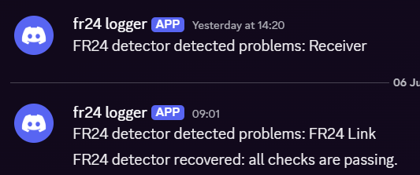

# FlightRadar24 Status Detector

*Note: this project is NOT affiliated with FlightRadar24 in ANY way*



The screenshot above shows the webhook messages sent by the daemon when problems are detected and when the service comes back online.

This is a script that periodically runs the `fr24feed-status` command to check if your radar is down before an email can be sent from FR24 to you. Whilst the grace periods are enough time to address any issues, sometimes problems can persist still even without you getting an email.

Also because I whipped this up whilst I was on holiday, and trust me, this made detecting network issues and loose connectors a lot easier.

## What it does

- Sends a webhook when FR24 first comes online after the daemon starts.
- Sends a webhook when FR24 status changes from healthy to unhealthy.
- Sends a recovery webhook when FR24 becomes healthy again.

The webhook payload is a plain JSON object with a `content` field, so it works well with Discord-style webhook endpoints.

## Dependencies

This program requires the following dependencies:
- Your fr24 feed
- curl

## Installation

There are some pre-compiled binaries available from the releases page, however installation and setting up the service is still manually required. Please note: if you are on any 32-bit CPU, such as ARM or i386, you **must** compile this app yourself.

### Compiling from source

Compiling is recommended if you have Rust installed as it only takes a few seconds

1. Download Rust if you haven't already
2. Clone the repo
```bash
git clone https://github.com/zephyrbash/fr24-detector
cd fr24-detector
```
3. Compile the project
```bash
cargo build --release --verbose
```

Now go to section *setup*

### Downloading from GitHub
1. Go to the latest release
2. Download either the AMD64 or ARM64 binary
3. Rename it to `fr24d`

Now go to the next section

### Setup
1. **(Optional)** move your binary to the local bin folder
```bash
# If you compiled yourself
mv target/release/fr24d /usr/local/bin/fr24d

# If you downloaded it (assuming you're in the same folder)
mv fr24d /usr/local/bin/fr24d
```
2. Create a service file like `/etc/systemd/system/fr24d.service` (unless you want to symlink) with the following content:
```toml
[Unit]
Description=fr24d Background Service
After=network.target
Wants=network.target

[Service]
Type=simple

# Change 'youruser' to the actual user account that should run the programme.
User=youruser
Group=yourgroup

# The absolute path to your compiled binary if you did not move the binary
ExecStart=/usr/local/bin/fr24d

# Restart it if it crashes
Restart=on-failure
RestartSec=10

# Logging: this sends standard output and errors straight to journalctl.
StandardOutput=journal
StandardError=journal

# Security: A few sensible restrictions to lock things down a bit.
ProtectSystem=full
NoNewPrivileges=true

[Install]
WantedBy=multi-user.target
```
3. Reload the service daemon and start the service
```bash
sudo systemctl daemon-reload
sudo systemctl enable fr24d.service
sudo systemctl start fr24d.service
sudo systemctl status fr24d.service
```
and to restart, such as after an update, just do
```bash
sudo systemctl restart fr24d.service
```

## Configuration

Use the CLI to manage the stored webhook URL:

```bash
fr24d config webhook set https://example.test/webhook
fr24d config webhook delete
```

The daemon stores its settings in `~/.fr24detector.sqlite3`. After the webhook is set, it will keep track of the last known FR24 state and only send a message when the state changes or when it starts for the first time.